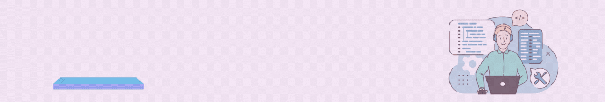

# ✨ ABOUT ME ✨ 

Hello, I'm Maria Angélica, a Junior Front End Developer with a great passion for design and web development. My goal is to create beautiful and engaging web experiences for users.

I have experience working with HTML, CSS, and JavaScript, and I am also comfortable using design tools like Figma. Currently, I am learning about React in the project. [DEV003-burger-queen-api-client](https://github.com/mariahiguera2210/DEV003-burger-queen-api-client)

# ✨ SOBRE MI ✨ 
Hola, soy Maria Angélica, una Front End Developer Jr con una gran pasión por el diseño y el desarrollo web. Mi objetivo es crear experiencias web hermosas y atractivas para los usuarios.

Tengo experiencia manejando HTML, CSS y JavaScript, también me siento cómoda trabajando con herramientas de diseño como Figma y actualmente estoy aprendiendo sobre React en el proyecto [DEV003-burger-queen-api-client](https://github.com/mariahiguera2210/DEV003-burger-queen-api-client). 

## ⚡ Fun facts :
- I like to read
- I'm a dancer

 
 </a>
 </a> 
 </a> 
 </a>  

